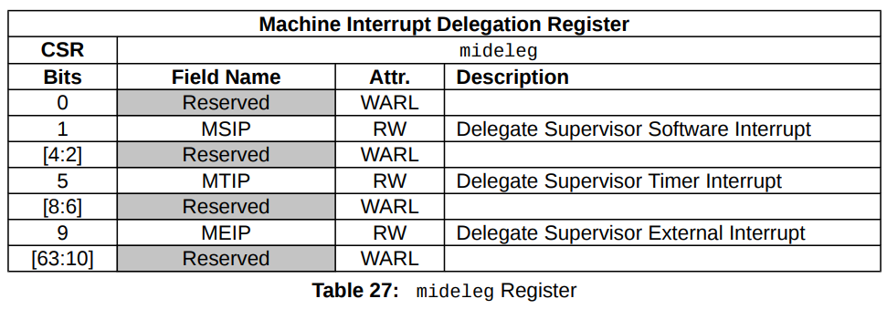

# Core Local Interruptor (CLINT)

## Exceção, Interrupção, Armadilha (Trap)

### Terminologias Básicas

### CLINT, CLIC, PLIC

explicar particularidades

CLINT = core local interrupter

CLIC = core local interrupt controller

PLIC = Platform Local Interrupt Controller 


1. **Exceções** se referem a uma condição incomum no sistema ocorrida em tempo
  de execução em uma instrução.
    - Exemplo: O endereço de um dado que não foi alinhado corretamente em uma instrução *load*, faz com que a CPU entre com o tratamento de exceção do tipo "endereço
    desalinhado", que irá aparecer no registrador **mcause**. 

2. **Interrupção** se refere a um evento externo que ocorre de forma **assíncrona** na 
  thread corrente.
  Quando uma interrupção precisa ser atendida, uma instrução é selecionada para receber
  a exceção de interrupção.
    - Exemplo: Um *timer* de interrupção é utilizado para acionar um evento futuro,
    sendo assim a CPU escreve em seu registrador **mtimecmp** o valor de **mtime** + ticks que se referem a um número de clocks de relógio no futuro. Como **mtime** 
    se incrementa automaticamente independente de qualquer instrução executada pela CPU,
    em algum ponto **mtimecmp** se iguala a **mtime** e dessa forma a CPU entra com o tratador de interrupção.


3. **Armadilha ou Trap**, se refere a uma transferência de controle **síncrona** para o
  tratador de armadilha devido a um condição excepcional causada na thread corrente (e.g execução de um programa que teve uma divisão por zero).
    - Exemplo: Seja uma CPU com três modos de operação: Máquina, Supervisor e Usuário.
      Cada um deles possui seus próprios registradores de controle e status (CSRs) para
      tratamento de armadilha e um área de pilhada dedicada a eles. Quando em modo usuário, uma troca de contexto é requerida para tratar de um evento em modo supervisor, o software configura o sistema para uma troca de contexto e
      chama a instrução **ECALL** que troca o controle para o tratador de exceção de ambiente de usuário.  

## interrupcoes sincronas e assincronas
sincronas = exception

assincrona = interrupt

elaborar mais

## Registradores

### Registradores da Máquina

#### Machine Status (mstatus)

- Acompanha e controla o estado operacional atual do hart.
- O bit `MIE` (Machine Interrupt Enable) indica se as interrupções estão habilitadas.
- Já o bit `MPIE` (Machine Previous Interrupt Enable) mantém o valor do bit `MIE` anterior, ou seja, salva o contexto anterior.
    ```
    mstatus.MPIE <- mstatus.MIE
    mstatus.MIE  <- 0
    ```
- Bit `MPP` recebe `Priv` (nível de privilégio atual). 
  - `mstatus.MPP = Priv`
- MRET instruction:
  ```
  mstatus.MIE <- mstatus.MPIE
  Priv <- mstatus.MPP
  ```
  


#### Machine Cause (mcause)

Indica qual evento que causou o trap, caso a causa seja uma interrupção o bit `Interrupt` é setado.
Já o campo `Code` indica qual o código da da interrupção/exceção.


Se for gerada mais de uma exceção síncrona, a tabela de prioridades é utilizada.


#### Machine Exception Program Counter (mepc)

Quando um trap é encontrado, `mepc` recebe o endereço virtual da instrução interrompida ou que encontrou a exceção.
Caso contrário, `mepc` nunca é escrito pela implementação, mas pode ser escrito explicitamente pelo software.


#### Machine Interrupt Pending (mip)

- Indica quais interrupções estão pendentes.


#### Machine Interrupt Enable (mie)

- Indica quais interrupções estão habilitadas.


#### Machine Trap-Vector Base-Address (mtvec)

Contém o endereço base da tabela de vetores de interrupção e a configuração do modo de interrupção. 
Todas as exceções síncronas usam para tratamento de exceções.
Sempre deve ser implementado, mas se poderá ser escrito varia com a implementação. 

Ele deve ser configurado no início do fluxo de inicialização, para eventuais tratamentos de exceções.

O campo `BASE` consiste no endereço base da tabela de vetores e `MODE` refere-se ao modo utilizado.


#### Machine Exception Delegation (medeleg)

- Delega exceções ao modo supervisor.


#### Machine Interrupt Delegation (mideleg)

- Delega interrupções ao modo supervisor.



#### Machine Trap Value (mtval)

Quando um trap é encontrado no modo Machine, `mtval` é definido como zero ou com informações específicas de exceção para auxiliar o software a lidar com o trap.
Caso contrário, `mtval` nunca é escrito pela implementação, embora possa ser escrito explicitamente pelo software.

A plataforma de hardware especificará quais exceções irão usá-lo.
Quando um ponto de interrupção de hardware é acionado ou ocorre uma exceção de busca, carregamento ou armazenamento de instruções desalinhadas, acesso ou falha de página, `mtval` é gravado com o endereço virtual com falha.
Seus bits mais significativos não usados, são colocados em 0.

Opcionalmente, o registrador `mtval` também pode ser usado para retornar os bits de instrução com falha em uma exceção de instrução ilegal (`mepc` aponta para a instrução com falha na memória).


### Comuns ao CLINT e CLIC

#### Machine Software Interrupt Pending (msip)

Cada CPU possui seu registrador.
Em sistemas com várias CPUs, uma CPU pode escrever no `msip` de qualquer outra.
Isso permite uma comunicação eficiente entre processadores.

Seu bit menos significativo é refletido no bit `mip.MSIP` e os demais estão em 0.
Todos os registradores `msip` são zerados no reset.

#### Machine Timer (mtime)

Esse registrador é único, contendo o número de ciclos a partir de `RTCCLK` (CPU real time clock) e deve ser executado em tempo constante, no reset seus campos serão zerados.
Interrupções são geradas quando `mtime >= mtimecmp`, a qual é indicada em `mip.MTIP`, e sempre vão para o tratador modo Machine (a não ser quando delegadas ao modo Supervisor com o uso do `mideleg`).


#### Machine Timer Compare (mtimecmp)

Usado em conjunto com `mtime` para interrupções de timer.
Não é resetado, diferente de `mtime`.
Cada CPU possui seu próprio registrador e pode ser escrito por outras CPUs.


## Modos de Operação

Existem dois modos de operação do CLINT, o **modo direto** e o **modo vetorizado**.
Para configurar os modos do CLINT, escreva no campo `mtvec.MODE`, que é o **bit[0]**
do registrador de status e controle (`mtvec`):

- Para o **modo direto**, `mtvec.MODE = 0`.
- Para o **modo vetorizado**, `mtvec.MODE = 1`.

O **modo direto** é o valor **padrão** de reset. 
O campo `mtvec.BASE` guarda o endereço base para interrupções e exceções, e deve ter um valor alinhado a um mínimo de **4 bytes no modo direto**, e um mínimo de **64 bytes no modo vetorizado**.

### Modo Direto

O **modo direto** significa que todas as interrupções têm armadilha para o mesmo tratador, e não há uma tabela de vetores implementada.
É a responsabilidade do **software** executar código para descobrir qual interrupção ocorreu.

O **tratador em software** no **modo direto**, deve primeiro ler `mcause.INTERRUPT` para determinar se uma **interrupção** ou **exceção** ocorreu, para então decidir o que fazer baseado no valor de `mcause.CODE` que contém o código de interrupção ou exceção respectivo.

### Modo Vetorizado

O **modo vetorizado** introduz um método para criar uma **tabela de vetores** que o **hardware** usa para reduzir a latência do tratamento de interrupções.
Quando uma interrupção acontece no **modo vetorizado**, o registrador `pc` será atribuído pelo hardware ao **endereço do índice** da **tabela de vetores**
correspondente ao **ID da interrupção**. Do **índice da tabela de vetores**, um ***jump*** subsequente irá ocorrer para atender a interrupção.

Lembre-se de que a **tabela de vetores** contém um ***opcode*** que é uma instrução de ***jump*** para um local específico.

## Interrupt Levels

### Software Interrupts - Interrupt ID #3

Interrupções de software são acionadas ao escrever no registrador `msip` de certa CPU.

### Timer Interrupts - Interrupt ID #7

`mtime >= mtimecmp`.

### External Interrupts - Interrupt ID #11

Interrupções globais geralmente vão para o PLIC primeiro e depois para CPU usando Interrupt ID #11.
Em sistemas que não possuam o PLIC, pode ser desativado com `mie.MEIE = 0`.

### Local Interrupts - Interrupt ID #16+

Conexões locais podem se conectar diretamente a uma fonte de interrupção e não precisam ir para o PLIC. 
Sua prioridade é fixa com base em Interrupt ID.
O número máximo de interrupções locais é dado por `XLEN - 16`.


## Entrada e Saída do Tratador de Interrupções

**Sempre** que ocorrer uma interrupção, o hardware salvará e restaurará automaticamente registros importantes.

Ao entrar:

```
mepc            <- pc
mstatus.MPP     <- priv
mstatus.MPIE    <- mstatus.MIE
pc              <- mtvec (se mtvec.MODE = Direct) | mtvec.BASE + 4 * exception_code 
mstatus.MIE     <- 0
```

Ao sair:

```
pc              <- MEPC
priv            <- mstatus.MPP
mstatus.MIE     <- mstatus.MPIE
```

**`priv` refere-se ao nível de privilégio atual, o qual não é visível quando estamos operando nesse nível.**

## RV32 vs RV64 (no CLINT)

A única diferença é referente ao `mstatus`, onde o registrador passa de 32 para 64 bits.

[//]: # (TODO: devemos explicar oq é cada bit de um registrador. ex: mie.)
[//]: # (falar sobre quando incrementar pc e oq fazer qnd n incrementa)

## Guia de Siglas (não colocar na wiki)

- CSRs: Control and Status Registers.
- HART: hardware threads.
- WARL: Write Any Values, Reads Legal Values.
- WLRL: Write/Read Only Legal Values.
- WPRI: Reserved Writes Preserve Values, Reads Ignore Values.
