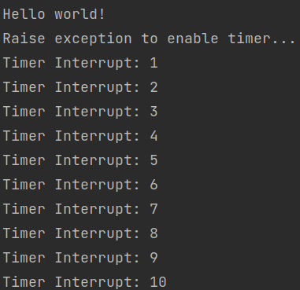

# RISC-V Bare Metal

Exemplo bare-metal de interrupção com CLINT no RISC-V.

## Requisitos
- qemu
- riscv64-linux-gnu-*

### Makefile

Alterar `ARCH =` para o caminho correto de acordo com sua instalação.

## Run
```bash
mkdir build
make
make run
```

## Resultado


